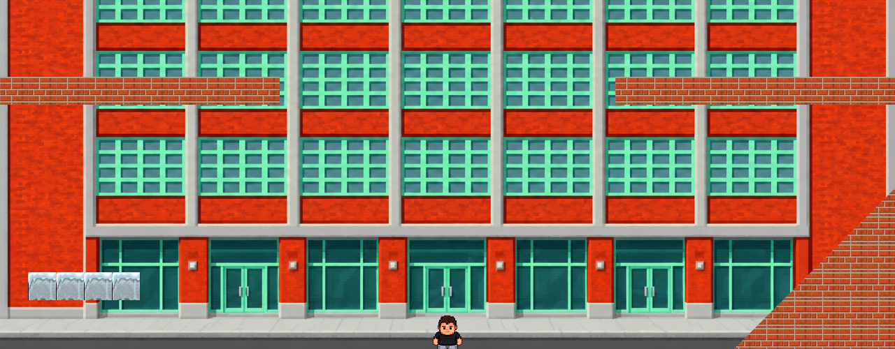

> *Start at the bottom. Reach for the golden heels.*

**Baťa on Top** is a browser climbing game built for Baťa / MDC events. Guide **Pjot** up a vertical tower, time your jumps, and race to the golden heels at the top. Fastest climbs land on the leaderboard.

## Play

| Action | Keys |
|--------|------|
| Move | `A` / `D` or arrow keys |
| Jump (hold to charge) | `Space` |
| Pause | `Esc` |

Works on desktop, tablet, and mobile.

## Run locally

**Frontend** (game)

```bash
cd frontend
npm install
npm run dev
```

**Backend** (leaderboard API, optional)

```bash
cd backend
composer install
cp .env.example .env
php artisan key:generate
php artisan migrate
php artisan serve
```

**MapBuilder** (author maps)

```bash
cd MapBuilder
npm install
npm run dev
```

## Stack

- **Frontend:** React, TypeScript, Vite, Phaser (Matter physics)
- **Backend:** Laravel
- **Maps:** JSON sections under `frontend/public/maps/`

Made for meetups, conferences, and MDC parties. Simple, skill-based, and a little bit retro.
